# 建筑劳务管理系统使用教程

本文档用于培训公司内部员工使用系统。教程以日常高频操作为主，适合预算员、项目经理、财务、老板、现场人员和系统管理员查看。

> 说明：文档中的截图基于当前系统页面生成，实际数据会根据登录账号权限、项目分配和录入数据不同而变化。

## 一、使用前准备

### 1. 登录要求

系统后续以钉钉账号为主，用户名优先显示钉钉真实姓名。正常情况下，未绑定钉钉的人员不应进入系统。

使用前请确认：

1. 已经加入公司钉钉组织。
2. 管理员已经在系统中创建或同步了你的账号。
3. 管理员已经给你分配了岗位和项目权限。
4. 如果你负责某些项目，管理员需要在项目分配中勾选你的负责项目。

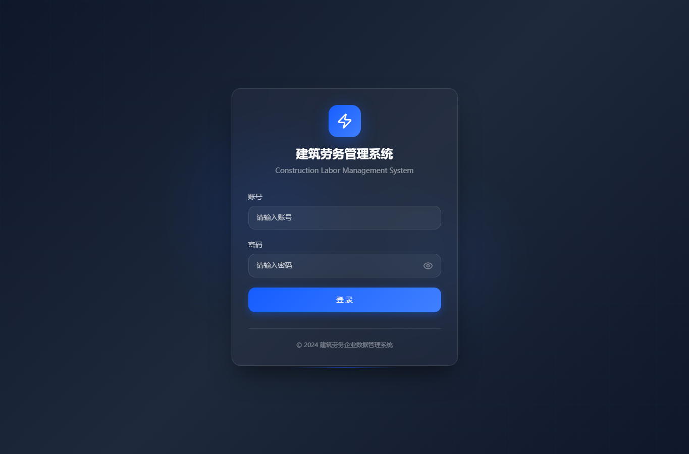

### 2. 权限说明

系统页面和数据会按照岗位与项目权限显示：

- 预算员：主要处理项目报量、签证、月度分析、收付款查看、投标测算。
- 项目经理：主要处理施工日志、签证推进、现场确认、出勤人员。
- 财务：主要处理工资发放、供应商付款、甲方回款、资金分析。
- 老板：主要查看经营分析、项目应收、成本利润、资金情况。
- 现场人员：主要填写施工日志、零星材料、拍照识别、出勤信息。
- 超级管理员：配置用户、权限、钉钉、WPS、通知、流程、AI。

如果你看不到某个项目或页面，通常是权限或项目分配未配置。

## 二、整体页面结构

系统左侧为一级导航，顶部为当前页面标题、消息提醒和用户信息。

一级导航包括：

1. 工作台
2. 项目管理
3. 施工管理
4. 人力资源
5. 供应商与费用
6. 经营分析
7. 投标测算
8. 知识库
9. 系统管理

移动端使用顶部菜单按钮打开左侧抽屉。

## 三、工作台使用

工作台面向所有员工，只保留高频操作入口和待我办理。

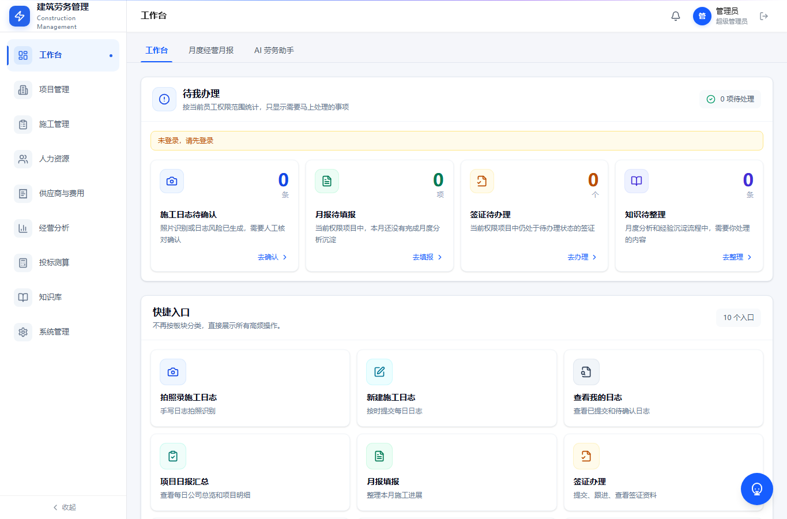

### 操作步骤

1. 登录后进入工作台。
2. 查看“待我办理”，确认是否有需要马上处理的事项。
3. 点击对应快捷入口进入业务页面。
4. 如果待办数量异常，先刷新页面；仍异常时联系管理员检查权限和通知配置。

### 使用建议

- 预算员每天先看待办，再进入项目管理和经营相关页面。
- 项目经理每天优先处理施工日志和签证提醒。
- 财务每天关注付款、发放和回款相关待办。

## 四、项目管理

项目管理是项目基础档案、报量、签证、产值结算、甲方回款的核心入口。

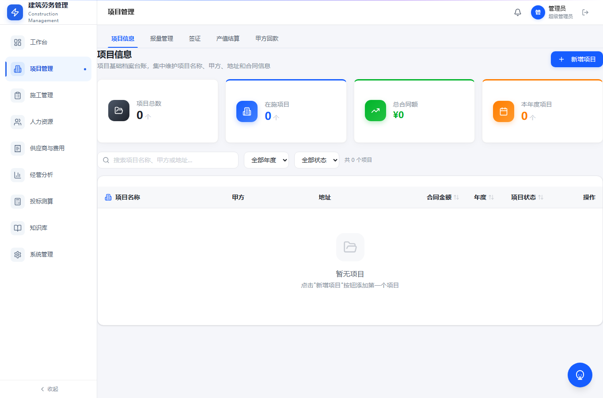

项目管理包含五个页签：

- 项目信息
- 报量管理
- 签证
- 产值结算
- 甲方回款

### 1. 项目信息

用于维护项目基础档案。

常用字段包括：

- 项目名称
- 甲方
- 地址
- 合同金额
- 年度
- 项目状态
- 负责人
- 不同状态下的付款比例

### 新增项目步骤

1. 进入“项目管理”。
2. 点击“项目信息”。
3. 点击“新增项目”。
4. 填写项目名称、甲方、地址、合同金额、年度等基础信息。
5. 维护项目状态和对应付款比例。
6. 保存后，项目会进入项目台账。

### 2. 报量管理

报量管理用于管理预算工程量、对上报量、对下结算量和内部附加清单。

使用逻辑：

- 预算工程量作为统一基础维度。
- 对上报量用于记录向甲方申报的工程量。
- 对下结算量用于记录对班组或工人的结算量。
- 内部附加清单只参与金额差异，不参与工程量差异。

### 报量查看步骤

1. 进入“项目管理”。
2. 点击“报量管理”。
3. 选择项目。
4. 查看项目整体汇总。
5. 下钻查看清单项明细。
6. 查看历史报量，核对当月、累计和剩余量。

### 3. 签证

签证用于记录现场签证从发起到最终确认计入结算的全过程。

签证流程：

1. 预算员录入签证内容和附件。
2. 预算员提交给项目经理。
3. 项目经理线下找甲方工程部签字。
4. 签字后，项目经理上传新附件，原附件完全替换。
5. 项目经理继续找甲方商务确认金额。
6. 商务确认后，项目经理提交给预算员。
7. 预算员确认签证已计入结算后，签证最终完成。

### 签证办理步骤

1. 进入“项目管理”。
2. 点击“签证”。
3. 点击新增签证。
4. 填写项目、签证内容、金额、附件。
5. 选择下一步负责人。
6. 提交后关注签证状态和提醒。
7. 如果超过一周未推进，系统会提醒负责人。

### 4. 产值结算

产值结算用于记录项目开票、结算、已付款和应付款情况。

重点字段：

- 结算金额
- 开票金额
- 已付款
- 按比例应付款
- 按比例应付未付款
- 100% 未付款

### 5. 甲方回款

甲方回款用于记录甲方实际付款情况，并与经营分析中的应收台账联动。

使用建议：

- 每次收到甲方付款后及时录入。
- 项目状态和付款比例会影响经营总览中的应收计算。
- 质保期满后的未收金额会进入账期风险。

## 五、施工管理

施工管理主要用于现场施工日志、拍照识别、人员出勤统计、项目日报汇总和月度经营月报。

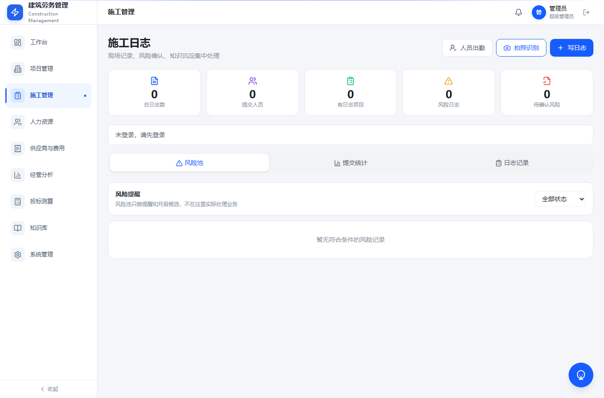

### 1. 施工日志提交规则

施工日志填写前要注意提交时效：

- 前一天下午 6 点至第二天早上 8 点：正常提交。
- 第二天早上 8 点至 12 点：允许补交，系统标记逾期提交。
- 第二天中午 12 点后：禁止提交前一天日志。

### 2. 写施工日志

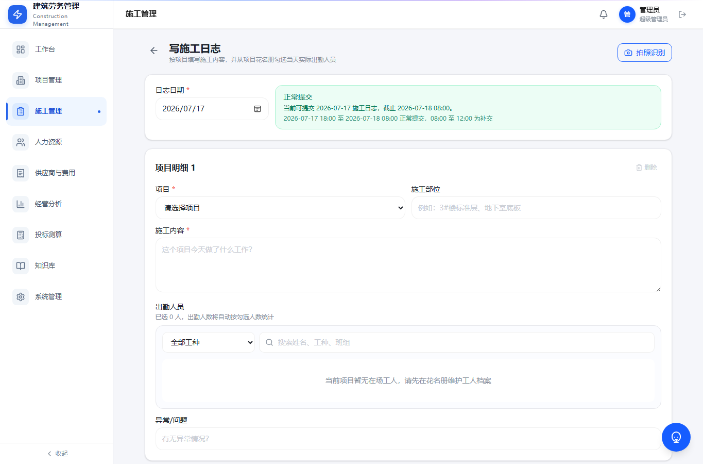

填写步骤：

1. 进入“施工管理”。
2. 点击“写施工日志”或“新增日志”。
3. 选择日志日期。
4. 选择项目。
5. 填写施工部位。
6. 填写施工内容。
7. 选择工种。
8. 从当前项目在场工人中选择出勤人员。
9. 给每个出勤人员录入工时，可录入小数。
10. 填写异常或问题。
11. 提交。

注意：

- 退场人员不会出现在可选人员中。
- 如果提示当前项目暂无在场工人，请检查花名册中该工人是否绑定当前项目、是否为在场状态。
- 出勤工时会汇总到“人员出勤统计”页面。

### 3. 拍照识别施工日志

适合现场人员仍然习惯手写日志的情况。

操作步骤：

1. 进入施工日志页面。
2. 点击“拍照识别”。
3. 上传或拍摄施工日志照片。
4. 系统进行文字识别。
5. AI 自动整理施工内容。
6. 人工确认识别结果。
7. 补充项目、出勤人员和出勤工时。
8. 提交。

注意：

- 图片用于识别，不建议长期保存大文件。
- AI 整理结果必须人工确认后再提交。

### 4. 人员出勤统计

用于按项目、月份、工人统计施工日志中记录的总工时。

查看步骤：

1. 进入“施工管理”。
2. 点击“人员出勤统计”。
3. 选择项目和月份。
4. 查看每名工人当月总工时。
5. 需要核实时，可回到施工日志详情查看来源。

### 5. 项目日报汇总

项目日报汇总不是简单罗列日志，而是系统根据各项目施工日志进行 AI 萃取。

使用方式：

1. 每天中午 12 点后，系统生成前一天日报汇总。
2. 先查看公司所有项目总览。
3. 再切换查看单个项目详细情况。
4. 关注异常、风险和未提交日志项目。

### 6. 月度经营月报

月度经营月报用于按月形成项目经营分析，并进入流程确认。

流程说明：

1. 预算员填写自己负责项目的月度分析。
2. 提交给手动选择的项目经理。
3. 项目经理确认后，自动返回最初提交的预算员。
4. 预算员确认后选择提交给老板。
5. 每个节点都会产生提醒。
6. 草稿状态可以删除。

## 六、人力资源

人力资源用于管理工人档案、证件、工资核算、工资发放和工资查询。

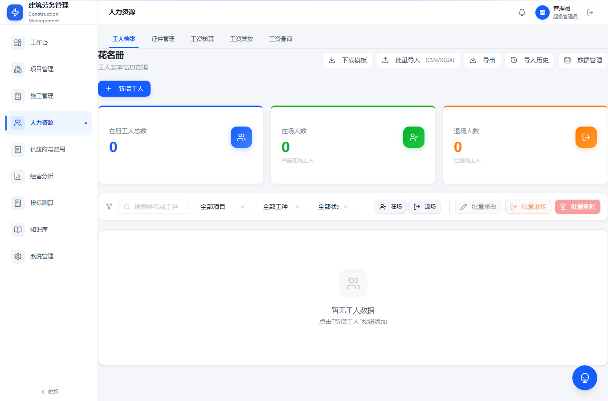

### 1. 工人档案

工人档案保存必要信息：

- 姓名
- 年龄
- 性别
- 银行卡号
- 身份证号
- 联系方式
- 入场日期
- 所属项目
- 在场或退场状态

注意：

- 身份证号是唯一识别字段。
- 工人调动项目不会影响历史工资归属。
- WPS 同步时只同步必要字段，不保存身份证照片、银行卡照片等大文件。

### 2. WPS 花名册同步

如果公司使用 WPS 智能表单收集花名册，可以在系统管理中配置 WPS 同步。

同步逻辑：

1. 每个项目一个二维码。
2. WPS 多维表格中每个项目对应一个工作表。
3. 系统中配置 WPS 项目名称和系统项目名称绑定关系。
4. 工人填写表单后，数据进入 WPS。
5. 系统按配置同步到工人档案。

### 3. 工资核算

工资核算表示当月工资表。

查看步骤：

1. 进入“人力资源”。
2. 点击“工资核算”。
3. 选择项目和月份。
4. 查看每个工人的应发、实发、已发和发清状态。

### 4. 工资发放

工资发放表示已经实际发出去的钱，可以和工资核算所属月份不同。例如 5 月发 3 月工资。

导入要求：

- 项目名称必填
- 身份证号必填
- 工资所属月份必填
- 发放金额必填

导入后，系统会按项目、身份证号、工资所属月份同步到工资核算，显示该月已发多少。

异常处理：

- 如果该人员当月无工资，系统提醒核实，但可继续录入并特别标注。
- 如果工人不在花名册中，系统提示是否新增工人档案，允许后续补充资料。
- 重复导入会被拦截。
- 实发金额和发放金额差值在 1 元以内，视为已发清。

### 5. 工资查询

用于员工或管理人员查看工资发放情况。

查看步骤：

1. 进入“人力资源”。
2. 点击“工资查询”。
3. 按项目、月份或人员筛选。
4. 查看核算金额、已发金额和发清状态。

## 七、供应商与费用

供应商与费用用于管理供应商库、结算、付款、零星材料和综合费用。

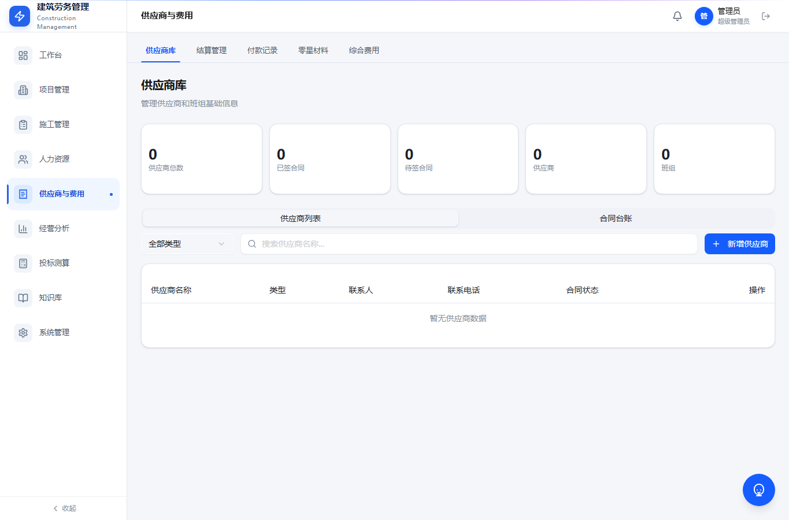

### 1. 供应商库

供应商库采用“统计卡片 + 台账”的形式。

重点查看：

- 供应商数量
- 已签合同
- 待签合同
- 累计结算额
- 供应商分类

操作步骤：

1. 进入“供应商与费用”。
2. 点击“供应商库”。
3. 查看顶部统计卡片。
4. 在台账中搜索供应商。
5. 进入详情查看合同、结算、付款和未付情况。

### 2. 结算管理

用于录入供应商或班组结算。

操作步骤：

1. 进入“结算管理”。
2. 点击新增结算。
3. 选择项目和供应商。
4. 填写结算金额、结算日期、结算类型和备注。
5. 保存后，系统会形成消息提醒，并可按配置推送钉钉。

### 3. 付款记录

用于记录已经实际支付给供应商的钱。

操作步骤：

1. 进入“付款记录”。
2. 点击新增付款。
3. 选择项目、供应商和对应结算。
4. 填写付款金额和付款日期。
5. 保存后，经营分析中的供应商成本会同步更新。

### 4. 零星材料

用于记录项目现场发生的小额辅材消耗。

操作步骤：

1. 进入“零星材料”。
2. 选择项目。
3. 填写材料名称、数量、单价和供应商。
4. 也可以使用拍照或语音识别。
5. AI 提炼后人工确认。
6. 保存后系统自动汇总到项目辅材消耗。

注意：

- 图片和音频只用于识别，不保存原文件。
- 材料费用必须绑定项目。

## 八、经营分析

经营分析主要给老板和管理层查看公司经营状况。

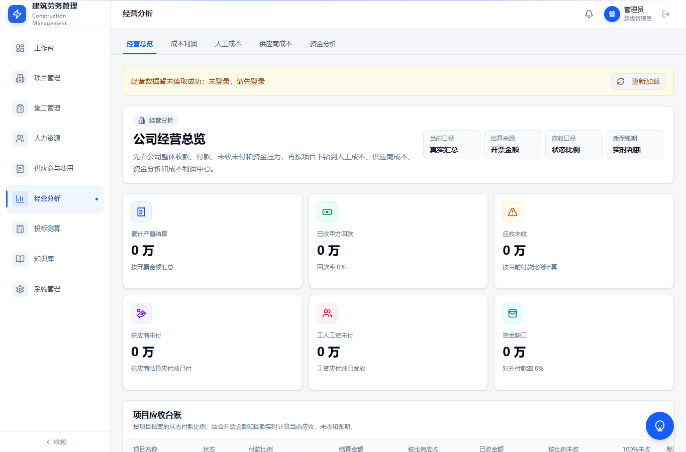

页面包括：

- 经营总览
- 成本利润
- 人工成本
- 供应商成本
- 资金分析

### 1. 经营总览

经营总览先看统计卡片，再看项目应收台账。

项目应收台账重点字段：

- 项目名称
- 状态
- 付款比例
- 结算金额，以开票金额为准
- 已收金额
- 按付款比例应收金额
- 按付款比例未收金额
- 100% 未收金额
- 账期
- 风险

使用步骤：

1. 进入“经营分析”。
2. 点击“经营总览”。
3. 查看顶部统计卡片。
4. 查看项目应收台账。
5. 对账期较长或风险较高的项目进行跟进。

### 2. 人工成本

人工成本来自工资核算和工资发放。

查看重点：

- 核算工资
- 已发工资
- 未发工资
- 发清率

### 3. 供应商成本

供应商成本与供应商与费用模块中的结算管理和付款记录关联。

查看重点：

- 每个项目供应商结算多少
- 应付多少
- 已付多少
- 未付多少
- 付款比例
- 进度应付款
- 决算应付款

### 4. 资金分析

用于查看公司收款、付款和资金压力。

使用建议：

- 甲方回款录入越及时，资金分析越准确。
- 工资发放和供应商付款录入越完整，资金压力判断越可靠。

## 九、投标测算

投标测算用于基于历史中标单价和人工成本单价辅助新项目报价。

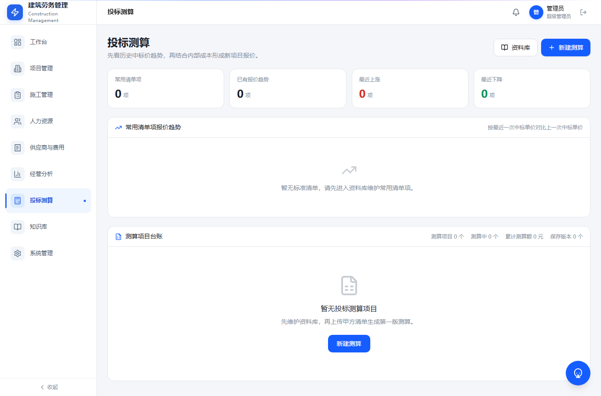

### 1. 历史数据查看

进入投标测算后，可以查看：

- 过去投标和成本数据
- 常用清单项报价趋势
- 最近一次中标单价与上一次中标单价差异
- 历史项目明细

### 2. 标准清单库

标准清单库用于维护公司内部统一清单编码。

操作步骤：

1. 进入“投标测算”。
2. 打开“标准清单库”。
3. 新增或批量导入标准清单。
4. 维护清单名称、编码、工程类型和是否含材料。
5. 如果导入清单时没有匹配项，可以当场新增标准清单。

### 3. 新建投标测算

操作步骤：

1. 进入“投标测算”。
2. 点击新建测算。
3. 上传报价清单。
4. 系统按清单名称相似度自动匹配标准清单。
5. 按地区、工程类型、是否含材料筛选历史价格。
6. 系统取最近一条中标单价和人工成本价。
7. 填写本次计划报价。
8. 设置管理费率和利润率。
9. 系统生成建议报价。
10. 如有需要，手动覆盖最终报价。
11. 点击保存。
12. 导出 Excel 测算表。

注意：

- 建议报价会特别提醒。
- 管理费率和利润率会叠加计算。
- 最终报价可人工调整。

## 十、知识库

知识库用于沉淀月度分析、施工日志、项目经验、合同报价经验和业务复盘。

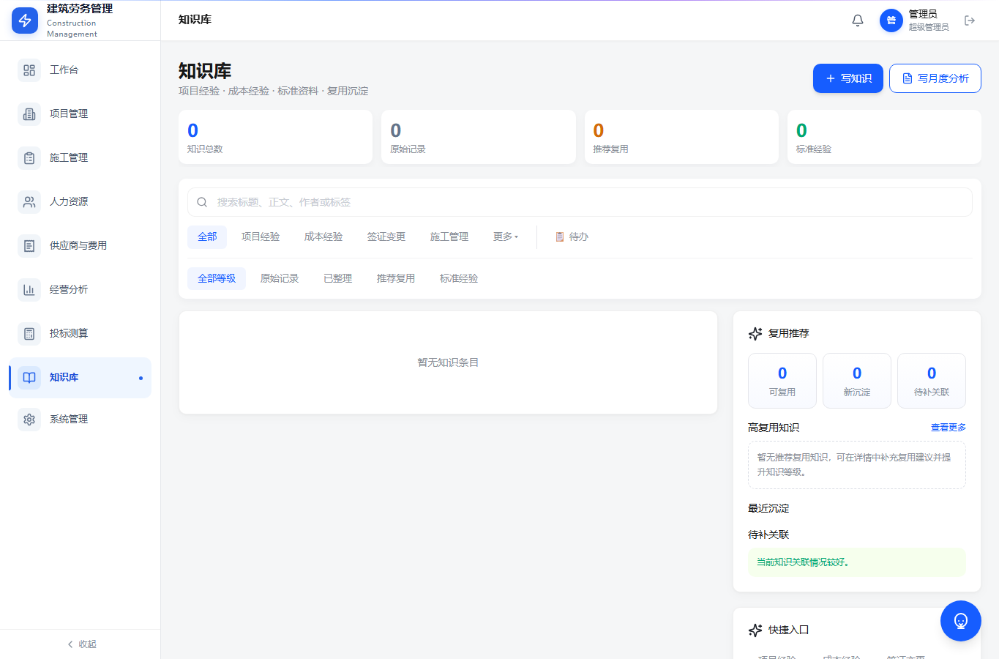

### 使用步骤

1. 进入“知识库”。
2. 使用搜索框查找项目、问题或关键词。
3. 按分类筛选知识。
4. 点击知识进入详情。
5. 查看关联项目、来源业务和沉淀内容。

### 月度分析状态

月度分析提交后，可以在知识库中查看状态。

常见状态：

- 草稿
- 已提交
- 项目经理确认中
- 预算员确认中
- 老板查看
- 已完成

草稿状态允许删除。

### 知识沉淀建议

每条知识尽量包含：

- 问题是什么
- 原因是什么
- 处理办法是什么
- 最终结果是什么
- 后续类似项目如何避免

## 十一、系统管理

系统管理主要由超级管理员使用。

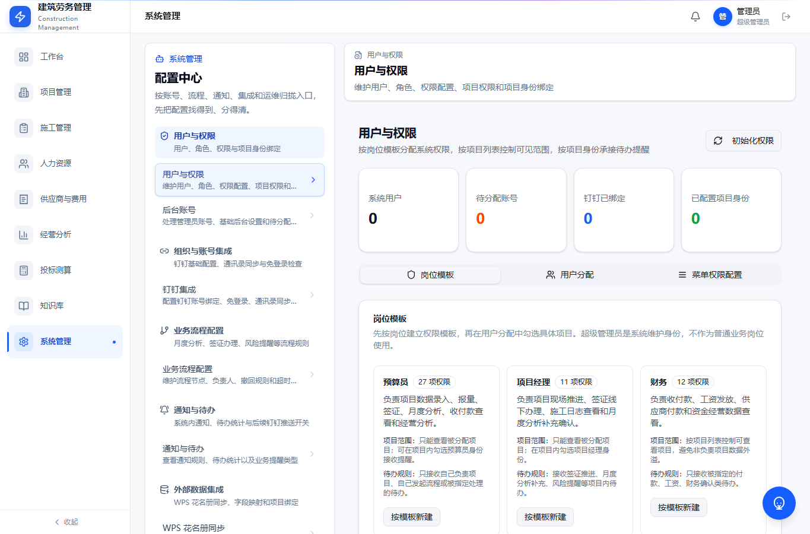

页面包括：

- 用户与权限
- 后台账号
- 钉钉集成
- 业务流程配置
- 通知与待办
- WPS 花名册同步
- AI 配置
- 操作日志

### 1. 用户与权限

配置步骤：

1. 进入“系统管理”。
2. 点击“用户与权限”。
3. 新增或选择用户。
4. 选择岗位模板。
5. 勾选项目权限。
6. 如果该用户负责某些项目，需要单独勾选负责项目。
7. 保存。

注意：

- 超级管理员拥有全部权限，但负责项目仍需单独勾选。
- 普通用户只能查看被分配项目。
- 老板可以查看所有业务明细。

### 2. 钉钉集成

配置内容：

- 钉钉免登录
- 个人消息推送
- 群机器人 Webhook
- 测试发送
- 推送日志

使用建议：

1. 先配置钉钉基础参数。
2. 再测试个人消息。
3. 再测试群机器人。
4. 最后配置自动消息类型和接收人。

### 3. 通知与待办

用于配置哪些业务消息自动推送给哪些人。

配置步骤：

1. 进入“系统管理”。
2. 点击“通知与待办”。
3. 选择消息类型。
4. 绑定具体接收人员。
5. 设置是否推送钉钉。
6. 设置是否进入系统待办。
7. 保存。

自动消息应尽量带业务摘要，例如：

- 某供应商新增结算，金额多少。
- 某项目签证待项目经理推进。
- 某月度分析待预算员确认。

### 4. 业务流程配置

当前重点流程：

- 签证流程
- 月度分析流程

配置建议：

- 流程节点不要过多。
- 每个节点必须明确处理人。
- 每次提交后都应产生系统待办和钉钉提醒。

### 5. WPS 花名册同步

配置步骤：

1. 进入“系统管理”。
2. 点击“WPS 花名册同步”。
3. 填写 WPS 文档链接。
4. 配置系统项目名称与 WPS 工作表项目名称绑定。
5. 设置同步方式。
6. 保存配置。
7. 点击同步测试。
8. 查看同步结果和失败原因。

注意：

- 系统只同步必要字段。
- 不同步身份证照片、银行卡照片等大文件。
- 如果 WPS 项目名称和系统项目名称不一致，需要先维护映射。

### 6. AI 配置

用于配置系统中的 AI 能力：

- 施工日志 OCR 识别
- 语音识别
- 施工日志自动整理
- 项目日报汇总
- 知识库问答
- 投标测算辅助匹配

## 十二、常见问题

### 1. 为什么我看不到某个项目？

通常是项目权限未分配。联系管理员检查“用户与权限”中的项目勾选。

### 2. 为什么待办数量不对？

可能原因：

- 当前账号没有对应项目权限。
- 通知接收人未绑定。
- 业务流程没有正确提交到下一步。
- 系统待办和钉钉通知配置未开启。

### 3. 施工日志选择出勤人员时没有工人怎么办？

检查以下内容：

1. 工人是否已经在花名册中。
2. 工人是否绑定当前项目。
3. 工人是否为在场状态。
4. 是否选择了正确工种。

### 4. 工资发放和工资查询金额不一致怎么办？

先核对：

1. 工资所属月份是否一致。
2. 项目名称是否一致。
3. 身份证号是否一致。
4. 发放金额是否重复导入。
5. 是否存在无工资核算记录但手动确认导入的发放数据。

### 5. 供应商成本看板没有数据怎么办？

先确认：

1. 是否录入供应商结算。
2. 是否录入供应商付款。
3. 结算和付款是否绑定项目。
4. 是否有查看经营分析的权限。

### 6. 钉钉测试能收到，自动消息收不到怎么办？

检查：

1. 通知类型是否启用。
2. 是否绑定接收人。
3. 接收人是否绑定钉钉账号。
4. 该业务是否触发了自动消息。
5. 推送日志中是否有失败原因。

### 7. WPS 同步没有效果怎么办？

检查：

1. WPS 文档链接是否正确。
2. 是否配置项目名称映射。
3. WPS 工作表名称是否与配置一致。
4. 必填字段是否存在。
5. 同步日志是否有失败原因。

## 十三、日常使用建议

### 预算员每日建议

1. 进入工作台查看待办。
2. 查看签证、月度分析、报量相关提醒。
3. 处理项目管理中的报量和签证。
4. 查看甲方回款和项目应收。
5. 必要时维护投标测算历史数据。

### 项目经理每日建议

1. 提交施工日志。
2. 选择出勤人员并录入工时。
3. 处理签证推进提醒。
4. 查看项目日报汇总。

### 财务每日建议

1. 录入甲方回款。
2. 导入工资发放。
3. 录入供应商付款。
4. 核对资金分析和未付款。

### 老板每周建议

1. 查看经营总览。
2. 查看项目应收台账。
3. 关注账期风险。
4. 查看供应商和人工未付压力。
5. 查看成本利润异常项目。

### 管理员每周建议

1. 检查用户权限和项目分配。
2. 检查钉钉推送日志。
3. 检查 WPS 同步结果。
4. 检查操作日志。
5. 处理员工反馈的问题。

## 十四、培训使用顺序

建议首次培训按以下顺序进行：

1. 讲登录和权限。
2. 讲工作台和待办。
3. 预算员重点讲项目管理、报量、签证、月度分析。
4. 项目经理重点讲施工日志、出勤工时、签证推进。
5. 财务重点讲工资发放、供应商付款、甲方回款。
6. 老板重点讲经营分析。
7. 管理员重点讲系统管理、钉钉、WPS 和通知。

系统正式试用期间，建议先让预算员、项目经理、老板和财务使用一个月；稳定后，再让现场人员全员使用施工日志和零星材料录入。
